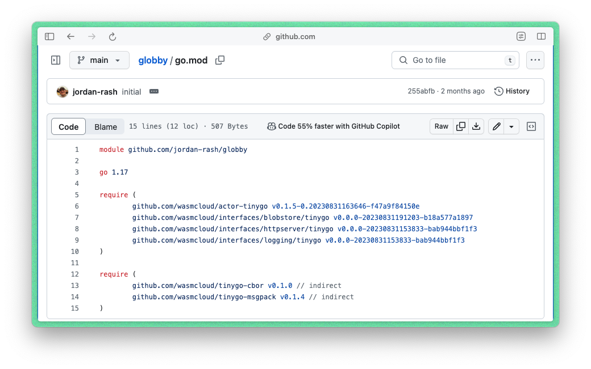
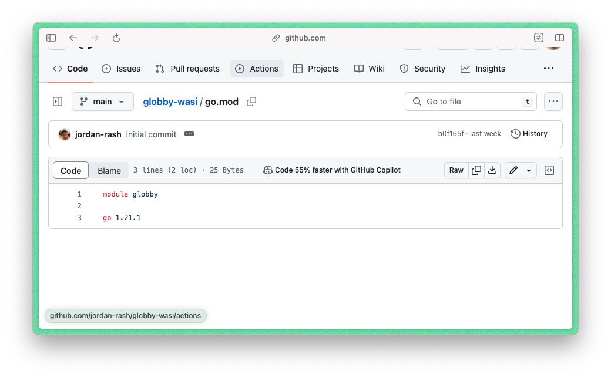

wasmCloud now comes with experimental support for Go, via TinyGo compiler, taking full advantage of the WebAssembly component model. This is an exciting moment as, for the first time, Go developers can build cloud native Wasm applications with components and run them in wasmCloud in an open, dependency-free and standards-based way.

<!--truncate-->

:::info

*[TinyGo](https://tinygo.org/)* is *"a Go compiler for small places"*. It is a language designed specifically to work on embedded systems and WebAssembly. For Gophers, TinyGo is commonly a simple change from running `go build` to running `tinygo build`, as TinyGo [supports many of the Go standard library packages](https://tinygo.org/docs/reference/lang-support/stdlib/).

:::

Some of the best-known organizations develop in Go; Google, Uber, Netflix, Twitch to name a few. There’s a growing appetite for Wasm amongst Go developers in all industries and so, with Go support now in wasmCloud, they have a community-driven, open environment to get WebAssembly projects off the ground.

### Rebuilding Actors as Components

wasmCloud has supported Go for [some time](https://wasmcloud.com/blog/example_creating_webassembly_actor_in_go_with_tinygo). As many in the community know, there are several TinyGo example Wasm applications, including `echo actor`, `blobby actor` and `kv-counter actor`, which were written around WASI-Preview 1 specifications. These examples compile to wasm modules and use our stable ABI and, as such, they rely on a few wasmCloud-specific dependencies to successfully run there. 

As wasmCloud is engineered around WASI-Preview 2, we have rewritten these actors to use WASI contracts; completely removing any dependencies. Smithy is a thing of the past as we focus on [WIT](https://cosmonic.com/blog/engineering/wit-cheat-sheet) to bind together polyglot components. Take a look at our new WASIfied apps `[echo-http-server](https://github.com/wasmCloud/wasmCloud/tree/main/examples/golang/actors/http-echo-tinygo)` and `[globby-wasi](https://github.com/jordan-rash/globby-wasi)` (blobby reimagined in Go!).

This means developers can port their Wasm applications to wasmCloud without any additional requirements. It also means, when componentized, applications are even tinier than before.

Long-time maintainer of wasmCloud Jordan Rash, and our own Roman Volosatovs, are working hard to bring a host of capabilities to WASI. Right now, these work with Version 7 of the host. By the time Wasmtime 15 comes out we’re hoping to have moved all our examples to WASI. Meantime, let’s take a closer look at what this means when developing Wasm applications for wasmCloud.

### No Dependencies, Zero Vulnerabilities

During a recent CNCF wasmCloud Community Meeting, Jordan explained how Blobby has been rewritten as [Globby with WASI](https://github.com/jordan-rash/globby-wasi) contracts, and how this changes the profile of the application itself. ICYMI, we’ve dropped in a recording of his demo further down.

:::info

[Blobby](https://github.com/wasmCloud/examples/tree/main/actor/blobby), aka “Little Blobby Tables”, is a simple file server showing the basic CRUD operations of the `wasmcloud:blobstore` contract. We implemented the same business logic using Go (compiled with TinyGo) and, as engineers who lack the ability to name things, Globby was born!

:::

In our earlier Blobby example, we can see 6 different dependencies including Smithy contracts and an imported library needed to interact with the host. The earlier module relies on these to run successfully in wasmCloud. Adding dependencies means more third party code to manage down the line, and all the potential issues that can bring.

Early TinyGo Blobby actor, written with the WASI-Preview 1 toolchain, with both external and wasmCloud-specific dependencies.

When written as a component, `globby-wasi` has no dependencies; when we look inside the mod file, it’s empty. The component is more like a library; it exposes an API once it’s instantiated and remains live, allowing functions to be called from the host or other components. What this means is you manage just your code, there is nothing down/up/aroundstream to maintain other than your own code. In recalling Log4j and all the issues that emanated, this is important: every vulnerability in `globby-wasi` will always show up in the go.mod file. No more bug hunts and a clean, safe application.

Written in WASI, Globby has zero dependencies which means fewer issues down the line.

**Embed Jordan’s demo here: @Brooks Townsend we could snip his section from the community meeting to add here.**

Of course, we want developers to have a choice of approach and so we’ll continue to support projects built in the SDK-oriented approach. wasmCloud has WebAssembly component support in both the WASI-Preview 1-style command module *and* the WASI-Preview 2-style reactor component. 

CTA: Review progress in the [Bytecode Alliance repo](https://github.com/bytecodealliance/meetings/tree/main/SIG-Guest-Languages/Go), where most of the current work is happening.

### What’s next?

Now that wasmCloud is ‘components-first’, you can expect to see us provide examples in a wide variety of languages in the coming months with the official release of WASI-Preview 2 early next year [link to BA blog]. Along the same lines, we look to support “Big Go” once it has support for the WebAssembly export directive, we’re closely following developments currently targeted for Go 1.22.